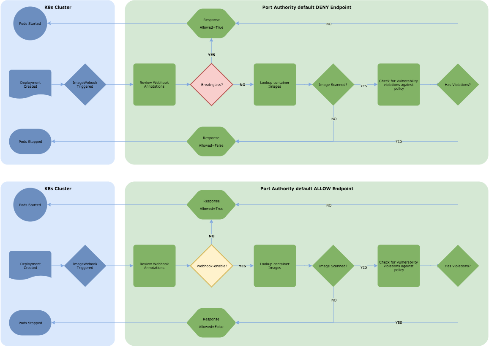

# Configuring Minikube to leverage the Port Authority ImagePolicyWebhook

The following steps have been tested running on a Mac in Minikube server version 1.7.x-1.9.x and Kubectl client version 1.7.x-1.9.x

#### Prerequisites

Ensure you've successfully completed the [Minikube Setup](/README.md#setup-and-start-minikube).

### Setup

1.  Modify the [image-review.example.yml](image-review.example.yml) where you see *** < my-id > ***

    ```yml
    # clusters refers to the remote service.
    # this config assumes you're running Port Authority in Minikube.
    # the IPs below are the one Minikube uses as your IP routable via the cluster.
    clusters:
    - name: image-review-server
      cluster:
        insecure-skip-tls-verify: true
        server: http://192.168.99.100:31700/v1/k8s-image-policy-webhook  #nodeport routable ip
        #server: http://10.0.2.2:6100/v1/k8s-image-policy-webhook ##local development routeable ip to your localhost

    # users refers to the API server's webhook configuration.
    users:
    - name: kube-apiserver
      user:
        client-certificate: /Users/<my-id>/.minikube/client.crt
        client-key: /Users/<my-id>/.minikube/client.key
    current-context: webhook
    contexts:
      - context:
          cluster: image-review-server
          user: kube-apiserver
        name: webhook
    ```

2.  Modify the [admission-controller.example.json](admission-controller.example.json) with the appropriate you see *** < my-id > *** path to the [image-review.example.yml](image-review.example.yml) file created in the previous step.

    ```json
    {
      "imagePolicy": {
         "kubeConfigFile": "/Users/<myid>/go/src/github.com/target/portauthority/docs/webhook-example/image-review.example.yml",
         "allowTTL": 50,
         "denyTTL": 50,
         "retryBackoff": 500,
         "defaultAllow": true
      }
    }
    ```

3.  Start Minikube with something similar to the following command after changing ** < my-id > **

    ```sh
    minikube start \
    --extra-config=apiserver.Admission.PluginNames=ImagePolicyWebhook \
    --extra-config=apiserver.Admission.ConfigFile=/Users/<my-id>/go/src/github.com/target/portauthority/docs/webhook-example/admission-controller.example.json
    ```
    Note: Minikube will NOT start if can't find a valid admission-controller.example.json file.

### Create a deployment to validate that it's working

1. Add the following annotations to your deployment

    ```
    apiVersion: extensions/v1beta1
    kind: Deployment
    metadata:
      labels:
        service: myapp-deployment
      name: myapp-deployment
    spec:
      template:
        metadata:
          labels:
            app: myapp-deployment
          annotations:
            alpha.image-policy.k8s.io/portauthority-webhook-enable: "true"
            alpha.image-policy.k8s.io/policy: "default"
        spec:
          containers:
          - name: postgres
            env:
              - name: PGUSER
                value: postgres
              - name: PGPASSWORD
                value: password
            image: postgres:9.6
    ```

### Default behavior of the webhook-example

The default behavior of the webhook is configurable on your Port Authority endpoint within `config.yml`:

1. Secure configuration (requires opt-out annotation):

   `imagewebhookdefaultblock: true`

2. Insecure configuration (requires opt-in annotation):

   `imagewebhookdefaultblock: false`

Flow Diagram:


